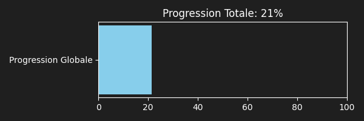
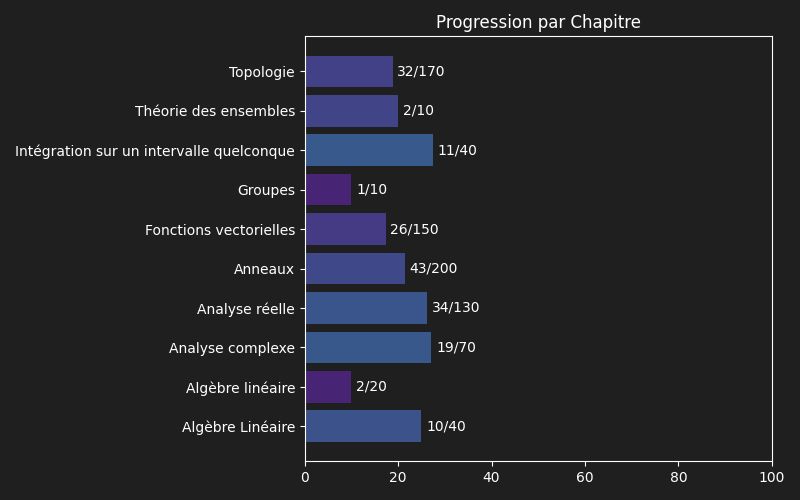

**47** Théorèmes à réviser sur **84** au total

# 📚 Révisions pour le 02/10/2026

**4** Théorèmes

## 1. Règle de D'Alembert

<b>Chapitre</b>

<blockquote>
Analyse complexe
</blockquote>

<b>Énoncé</b>

---

Soit $\sum a_n z^n$ une série entière with $a_n \neq 0$ pour $n$ assez grand.
Si $\lim_{n \to \infty} \left|\frac{a_{n+1}}{a_n}\right| = \ell \in [0, +\infty]$, alors le rayon de convergence $R$ de la série est :
$$R = \frac{1}{\ell}$$
(avec la convention $1/0 = +\infty$ et $1/\infty = 0$).

---

## 2. Formule de Taylor avec reste intégral

<b>Chapitre</b>

<blockquote>
Analyse réelle
</blockquote>

<b>Énoncé</b>

---

Soit $f \in \mathcal{C}^{n+1}(I, E)$. Soient $a, b \in I$.
Alors :
$$f(b) = \sum_{k=0}^n \frac{f^{(k)}(a)}{k!} (b-a)^k + \int_a^b \frac{(b-t)^n}{n!} f^{(n+1)}(t) dt$$

---

## 3. Théorème de la double limite

<b>Chapitre</b>

<blockquote>
Fonctions vectorielles
</blockquote>

<b>Énoncé</b>

---

Soit $X$ un ensemble et $(E, \|\cdot\|)$ un espace de Banach (espace vectoriel normé complet). Soit $a \in \overline{X}$ (avec $a \in \overline{\mathbb{R}}$ si $E = \mathbb{R}$). Soit $(f_n)_{n \in \mathbb{N}}$ une suite de fonctions de $X$ vers $E$.
Supposons que :

1. Pour tout $n \in \mathbb{N}$, $\lim_{x \to a} f_n(x) = \lambda_n$ existe dans $E$.
2. La suite $(f_n)$ converge uniformément vers une fonction $f : X \to E$.

Alors :

- La suite $(\lambda_n)_{n \in \mathbb{N}}$ converge vers une limite $\lambda \in E$.
- La fonction $f$ admet une limite en $a$ qui est égale à $\lambda$.

On a alors l'égalité : $\lim_{n \to \infty} \lim_{x \to a} f_n(x) = \lim_{x \to a} \lim_{n \to \infty} f_n(x)$.

---

## 4. Caractérisation de l'égalité des idéaux engendrés par deux éléments

<b>Chapitre</b>

<blockquote>
Anneaux
</blockquote>

<b>Énoncé</b>

---

Soit $A$ un anneau commutatif intègre, $a, b \in A$.
$$(a) = (b) \iff a \text{ et } b \text{ sont associés (i.e. } \exists u \in A^\times, a = ub)$$ 

---

 

# 📚 Révisions pour le 03/10/2026

**11** Théorèmes

## 1. Théorème de Heine

<b>Chapitre</b>

<blockquote>
Topologie
</blockquote>

<b>Énoncé</b>

---

Soit $f : E \to F$ une application continue d'un espace métrique compact $E$ dans un espace métrique $F$.
Alors $f$ est uniformément continue sur $E$, c'est-à-dire :
$$\forall \varepsilon > 0, \exists \delta > 0, \forall x, y \in E, d_E(x, y) < \delta \implies d_F(f(x), f(y)) < \varepsilon$$

---

## 2. Théorème de dérivation d'une suite de fonctions

<b>Chapitre</b>

<blockquote>
Fonctions vectorielles
</blockquote>

<b>Énoncé</b>

---

Soit $I$ un intervalle de $\mathbb{R}$ et $(E, \|\cdot\|)$ un espace de Banach (espace vectoriel normé complet). Soit $(f_n)_{n \in \mathbb{N}}$ une suite de fonctions de classe $\mathcal{C}^1$ de $I$ vers $E$. Supposons que :

1. Il existe un point $x_0 \in I$ tel que la suite $(f_n(x_0))_{n \in \mathbb{N}}$ converge dans $E$.
2. La suite des dérivées $(f_n')_{n \in \mathbb{N}}$ converge uniformément sur tout segment de $I$ vers une fonction $g : I \to E$.

Alors :

- La suite $(f_n)_{n \in \mathbb{N}}$ converge uniformément sur tout segment de $I$ vers une fonction $f : I \to E$.
- La fonction $f$ est de classe $\mathcal{C}^1$ sur $I$ et sa dérivée est $f' = g$.

---

## 3. Théorème de continuité d'une intégrale à paramètre

<b>Chapitre</b>

<blockquote>
Intégration sur un intervalle quelconque
</blockquote>

<b>Énoncé</b>

---

Soit $X\subset E$ un espace vectoriel normé de dimension finie et $I$ un intervalle de $\mathbb{R}$. Soit $f : X \times I \to \mathbb{C}$ telle que :

1. Pour tout $x \in X$, la fonction $t \mapsto f(x, t)$ est continue par morceaux sur $I$.
2. Pour tout $t \in I$, la fonction $x \mapsto f(x, t)$ est continue sur $X$.
3. Il existe $\varphi \in \mathcal{C}_{m}(I, \mathbb{R}^+)$ intégrable sur $I$ telle que pour tout $(x, t) \in X \times I$, $|f(x, t)| \le \varphi(t)$ (hypothèse de domination).

Alors la fonction $F : x \mapsto \int_I f(x, t) dt$ est définie et continue sur $X$.

---

## 4. Algèbre

<b>Chapitre</b>

<blockquote>
Anneaux
</blockquote>

<b>Énoncé</b>

---

Soit $R$ un anneau commutatif. Une $R$-**algèbre** est un anneau $A$ muni d'un morphisme d'anneaux $f : R \to A$ tel que $f(R) \subseteq Z(A)$.

---

## 5. Caractérisation d'un élément irréductible dans un anneau principal

<b>Chapitre</b>

<blockquote>
Anneaux
</blockquote>

<b>Énoncé</b>

---

Soit $A$ un anneau principal. Soit $p \in A \setminus \{0\}$.
Les assertions suivantes sont équivalentes :

1. $p$ est irréductible.
2. L'idéal $(p)$ est premier.
3. L'idéal $(p)$ est maximal.

---

## 6. Homéomorphisme

<b>Chapitre</b>

<blockquote>
Topologie
</blockquote>

<b>Énoncé</b>

---

Une application $f : E \to F$ entre deux espaces topologiques est un homéomorphisme si :

$(i)$ $f$ est bijective

$(ii)$ $f$ est continue

$(iii)$ $f^{-1}$ est continue

---

## 7. Théorème de limite de la dérivée

<b>Chapitre</b>

<blockquote>
Fonctions vectorielles
</blockquote>

<b>Énoncé</b>

---

Soit $(E, \|\cdot\|)$ un $\mathbb{K}$-espace vectoriel de dimension finie. Soit $I$ un intervalle de $\mathbb{R}$ et $a \in I$. Soit $f : I \to E$ une fonction continue sur $I$ et dérivable sur $I \setminus \{a\}$.
Si $f'(x) \xrightarrow[x \to a]{} l$ existe (avec $l \in E$), alors $f$ est dérivable en $a$ et $f'(a) = l$.
La fonction $f'$ est alors continue en $a$.

---

## 8. Lemme de Gauss

<b>Chapitre</b>

<blockquote>
Groupes
</blockquote>

<b>Énoncé</b>

---

Soient $a, b, c \in \mathbb{Z}$. Si $a \mid bc$ et si $a$ est premier avec $b$, c'est-à-dire si $\operatorname{pgcd}(a,b)=1$, alors :
$$a \mid c.$$

---

## 9. Théorème chinois, version générale

<b>Chapitre</b>

<blockquote>
Anneaux
</blockquote>

<b>Énoncé</b>

---

Soit $A$ un anneau. Soient $I, J$ deux idéaux de $A$. Si $I + J = A$, alors $I \cap J = IJ$ et l'on a l'isomorphisme d'anneaux :
$$A/(I \cap J) \cong A/I \times A/J$$

Plus généralement, soit $A$ un anneau. Soient $I_1, \dots, I_n$ des idéaux de $A$.
On considère le morphisme d'anneaux :
$$\phi : A \to A/I_1 \times \dots \times A/I_n$$
$$x \mapsto (x \pmod{I_1}, \dots, x \pmod{I_n})$$

1. Le noyau de $\phi$ est $\text{Ker}(\phi) = \bigcap\limits_{i=1}^n I_i$.
2. Si les idéaux sont deux à deux comaximaux (i.e. $I_i + I_j = A$ pour $i \neq j$), alors :
   - $\prod\limits_{i=1}^n I_i = \bigcap\limits_{i=1}^n I_i$
   - Le morphisme $\phi$ est surjectif.
     En particulier, on a l'isomorphisme d'anneaux :
     $$A / \left( \bigcap\limits_{i=1}^n I_i \right) \cong \prod\limits_{i=1}^n A/I_i$$

---

## 10. Points intérieurs, adhérents, isolés et d'accumulation

<b>Chapitre</b>

<blockquote>
Topologie
</blockquote>

<b>Énoncé</b>

---

Soit $(E, d)$ un espace métrique et $A \subseteq E$.

Un point $x \in E$ est **intérieur** à $A$ s'il existe $r > 0$ tel que
$B(x, r) \subseteq A.$

Un point $x \in E$ est **adhérent** à $A$ si
$\forall r > 0, \quad B(x, r) \cap A \neq \emptyset.$

Un point $x \in A$ est **isolé** dans $A$ s'il existe $r > 0$ tel que
$B(x, r) \cap A = \{x\}.$
A est dit **discret** si tous ses points sont isolés.

Un point $x \in E$ est un **point d'accumulation** de $A$ si
$\forall r > 0, \quad B(x, r) \cap (A \setminus \{x\}) \neq \emptyset.$
$$\overline{A} = \text{Acc}(A) \sqcup \text{Isol}(A)$$

---

## 11. Anneau euclidien

<b>Chapitre</b>

<blockquote>
Anneaux
</blockquote>

<b>Énoncé</b>

---

Un anneau commutatif intègre $A$ est dit **euclidien** s'il existe une application $\varphi : A \setminus \{0\} \to \mathbb{N}$, appelée stathme, telle que :
$$\forall (a, b) \in A \times A \setminus \{0\}, \exists (q, r) \in A^2, \quad a = bq + r \quad \text{avec} \quad r = 0 \text{ ou } \varphi(r) < \varphi(b)$$

De plus, tout anneau **euclidien** est **principal**.

Exemples

---

- L'anneau $\mathbb{Z}$ avec le stathme $\varphi(n) = |n|$.
- L'anneau des entiers de Gauss $\mathbb{Z}[i]$ avec le stathme $\varphi(a+ib) = a^2 + b^2$.
- L'anneau des polynômes $k[X]$ sur un corps $k$ avec le stathme $\varphi(P) = \deg(P)$.

L'algorithme de la division euclidienne fonctionne dans $A[X]$ pour tout anneau commutatif $A$, à condition que le diviseur possède un coefficient dominant inversible dans $A$.

---

 

# 📚 Révisions pour le 04/10/2026

**32** Théorèmes

## 1. Factorisation de $a^n - b^n$

<b>Chapitre</b>

<blockquote>
Analyse réelle
</blockquote>

<b>Énoncé</b>

---

Soient $a, b \in \mathbb{C}$ et $n \in \mathbb{N}^*$. On a :
$$a^n - b^n = (a-b) \sum_{k=0}^{n-1} a^{n-1-k} b^k$$

---

## 2. Inégalité de Taylor-Lagrange

<b>Chapitre</b>

<blockquote>
Analyse réelle
</blockquote>

<b>Énoncé</b>

---

Soit $f \in \mathcal{C}^n([a, b], E)$ telle que $f^{(n)}$ soit dérivable sur $]a, b[$.
Alors :
$$\left\| f(b) - \sum_{k=0}^n \frac{f^{(k)}(a)}{k!} (b-a)^k \right\| \le \frac{(b-a)^{n+1}}{(n+1)!} \sup_{t \in ]a, b[} \|f^{(n+1)}(t)\|$$

---

## 3. Lemme d'Euclide

<b>Chapitre</b>

<blockquote>
Anneaux
</blockquote>

<b>Énoncé</b>

---

Soit $A$ un anneau principal. Soit $p \in A$ un élément irréductible. Soient $a, b \in A$.
Si $p | ab$, alors $p | a$ ou $p | b$.

---

## 4. Théorème d'intégration terme à terme d'une série de fonctions

<b>Chapitre</b>

<blockquote>
Fonctions vectorielles
</blockquote>

<b>Énoncé</b>

---

Soit $I$ un intervalle de $\mathbb{R}$ et $(E, \|\cdot\|)$ un espace vectoriel normé. Soit $\sum f_n$ une série de fonctions continues de $I$ vers $E$. On suppose que la série $\sum f_n$ converge uniformément sur tout segment de $I$ vers une fonction $S : I \to E$.

Alors $S$ est continue sur $I$, et pour tout $x_0 \in I$, la suite des sommes partielles des primitives $(\sum\limits_{k=0}^n \int_{x_0}^x f_k(t) dt)_{n \in \mathbb{N}}$ converge simplement et uniformément sur tout segment de $I$ vers la fonction $x \mapsto \int_{x_0}^x S(t) dt$.

On a notamment pour tout $[a, b] \subseteq I$ :
$$\int_a^b \left( \sum\limits_{n=0}^\infty f_n(t) \right) dt = \sum\limits_{n=0}^\infty \int_a^b f_n(t) dt$$

---

## 5. Pivot de Gauss

<b>Chapitre</b>

<blockquote>
Algèbre Linéaire
</blockquote>

<b>Énoncé</b>

---

Le pivot de Gauss consiste à transformer une matrice par opérations élémentaires sur les lignes : échanger deux lignes, multiplier une ligne par un scalaire non nul ou ajouter à une ligne un multiple d'une autre.

---

### Calcul du rang

On choisit un pivot non nul et on annule les coefficients situés en dessous. Si le pivot est nul, on échange la ligne avec une ligne située plus bas. Le rang est alors le nombre de lignes non nulles de la forme échelonnée.

Par exemple, pour le système

$$
\begin{cases}
x+y+z=6,\\
2x-y+z=3,\\
x+2y-z=2,
\end{cases}
$$

la matrice augmentée, dont la dernière colonne contient le second membre, se réduit ainsi :

$$
\left(\begin{array}{ccc|c}
1 & 1 & 1 & 6\\
2 & -1 & 1 & 3\\
1 & 2 & -1 & 2
\end{array}\right)
\xrightarrow{\substack{L_2\leftarrow L_2-2L_1\\L_3\leftarrow L_3-L_1}}
\left(\begin{array}{ccc|c}
1 & 1 & 1 & 6\\
0 & -3 & -1 & -9\\
0 & 1 & -2 & -4
\end{array}\right)
\xrightarrow{L_3\leftarrow 3L_3+L_2}
\left(\begin{array}{ccc|c}
1 & 1 & 1 & 6\\
0 & -3 & -1 & -9\\
0 & 0 & -7 & -21
\end{array}\right).
$$

La solution est donc $(1, 2, 3)$.

---

### Bases du noyau et de l'image

Considérons la matrice $3\times3$

$$
A=\begin{pmatrix} 1 & 2 & 3 \\ 2 & 4 & 6 \\ 3 & 6 & 9 \end{pmatrix}
\quad\text{et l'application } f(X)=AX.
$$

La réduction donne

$$
\begin{pmatrix} 1 & 2 & 3 \\ 2 & 4 & 6 \\ 3 & 6 & 9 \end{pmatrix}
\xrightarrow{\substack{L_2\leftarrow L_2-2L_1\\L_3\leftarrow L_3-3L_1}}
\begin{pmatrix} 1 & 2 & 3 \\ 0 & 0 & 0 \\ 0 & 0 & 0 \end{pmatrix}.
$$

Pour trouver le noyau, on résout $AX=0$ avec $X=(x,y,z)$. Il reste l'équation

$$
x+2y+3z=0.
$$

Les variables $y$ et $z$ sont libres. En posant $y=s$ et $z=t$, on obtient $x=-2s-3t$, donc

$$
X=\begin{pmatrix}x\\y\\z\end{pmatrix}
 =s\begin{pmatrix}-2\\1\\0\end{pmatrix}
 +t\begin{pmatrix}-3\\0\\1\end{pmatrix},
\quad\text{donc}\quad
\ker(f)=\operatorname{Vect}\left\{\begin{pmatrix}-2\\1\\0\end{pmatrix},\begin{pmatrix}-3\\0\\1\end{pmatrix}\right\}.
$$

La seule colonne pivot est la première. Une base de l'image est donc donnée par la première colonne de la matrice initiale :

$$
\operatorname{Im}(f)=\operatorname{Vect}\left\{\begin{pmatrix}1\\2\\3\end{pmatrix}\right\}.
$$

> **Principe général** : Les opérations sur les lignes conservent les relations de dépendance linéaire entre les colonnes. Pour obtenir une base de $\text{Im}(A)$, on peut choisir n'importe quelle famille d'indices de colonnes qui forment une base de l'image de la matrice **échelonnée**, et extraire les colonnes correspondantes dans la matrice **initiale**.
>
> *Exemple* : Si la forme échelonnée est $U = \begin{pmatrix} 1 & 2 & 0 \\ 0 & 0 & 1 \\ 0 & 0 & 0 \end{pmatrix}$, les colonnes 1 et 3 sont les colonnes pivots (base évidente), mais les colonnes 2 et 3 sont également libres dans $U$. On peut donc aussi former une base de $\text{Im}(A)$ en prenant les colonnes 2 et 3 de la matrice $A$ d'origine.

---

### Calcul d'un inverse

Chaque opération élémentaire revient à multiplier à gauche par une matrice élémentaire inversible. Ainsi, en partant de $(A\mid I_n)$, une suite d'opérations donne

$$
(A\mid I_n)\longmapsto(PA\mid P),
$$

Si la partie gauche devient $I_n$, alors $P=A^{-1}$ : on lit l'inverse à droite.

Par exemple, $L_2\leftarrow L_2-3L_1$ correspond à la matrice élémentaire inversible

$$
E=\begin{pmatrix} 1 & 0 & 0 \\ -3 & 1 & 0 \\ 0 & 0 & 1 \end{pmatrix},
\qquad
E^{-1}=\begin{pmatrix} 1 & 0 & 0 \\ 3 & 1 & 0 \\ 0 & 0 & 1 \end{pmatrix}.
$$

L'inverse correspond à l'opération réciproque $L_2\leftarrow L_2+3L_1$.

Exemple en dimension $3$ : considérons

$$
B=\begin{pmatrix} 1 & 1 & 0 \\ 0 & 1 & 1 \\ 0 & 0 & 1 \end{pmatrix}.
$$

La méthode de Gauss-Jordan donne :

$$
\left(\begin{array}{ccc|ccc}
1 & 1 & 0 & 1 & 0 & 0\\
0 & 1 & 1 & 0 & 1 & 0\\
0 & 0 & 1 & 0 & 0 & 1
\end{array}\right)
\xrightarrow{L_2\leftarrow L_2-L_3}
\left(\begin{array}{ccc|ccc}
1 & 1 & 0 & 1 & 0 & 0\\
0 & 1 & 0 & 0 & 1 & -1\\
0 & 0 & 1 & 0 & 0 & 1
\end{array}\right)
\xrightarrow{L_1\leftarrow L_1-L_2}
\left(\begin{array}{ccc|ccc}
1 & 0 & 0 & 1 & -1 & 1\\
0 & 1 & 0 & 0 & 1 & -1\\
0 & 0 & 1 & 0 & 0 & 1
\end{array}\right).
$$

Ainsi,

$$
B^{-1}=\begin{pmatrix} 1 & -1 & 1 \\ 0 & 1 & -1 \\ 0 & 0 & 1 \end{pmatrix}.
$$

---

### Exercice

Soit $A$ la matrice définie par

$$
A = \begin{pmatrix}
1 & 10 & 3 & 1 \\
2 & 5 & 1 & -3 \\
-1 & -1 & 0 & 2
\end{pmatrix}.
$$

Calculer le rang de $A$, déterminer une base de son image et une base de son noyau.

Solution

---

- $\operatorname{rg}(A)=2$ ;
- une base de $\operatorname{Im}(A)$ est formée par les deux premières colonnes :
  $$\big((1,2,-1),(10,5,-1)\big)$$
- une base de $\ker(A)$ est :
  $$\big((1,-1,3,0),(7,-1,0,3)\big).$$

---

## 6. Théorème du rang

<b>Chapitre</b>

<blockquote>
Algèbre Linéaire
</blockquote>

<b>Énoncé</b>

---

Soient $E$ et $F$ deux espaces vectoriels de dimension finie sur un corps $\mathbb{k}$. Soit $u \in \mathcal{L}(E, F)$ une application linéaire de $E$ dans $F$.
Alors :
$$\dim(E) = \dim(\text{Ker}(u)) + \text{rg}(u)$$
où $\text{Ker}(u)$ est le noyau de $u$ et $\text{rg}(u) = \dim(\text{Im}(u))$ est le rang de $u$.

---

## 7. Bon ordre

<b>Chapitre</b>

<blockquote>
Théorie des ensembles
</blockquote>

<b>Énoncé</b>

---

Un ordre sur un ensemble $E$ est dit **bon** si toute partie non vide de $E$ possède un minimum.

---

## 8. Formule de Taylor-Young

<b>Chapitre</b>

<blockquote>
Analyse réelle
</blockquote>

<b>Énoncé</b>

---

Soit $f \in \mathcal{C}^n(I, E)$ où $E$ est un espace vectoriel normé de dimension finie. Soit $a \in I$.

Alors, au voisinage de $h=0$ tel que $a+h \in I$ :
$$f(a+h) = \sum_{k=0}^n \frac{f^{(k)}(a)}{k!} h^k + o(h^n)$$

---

## 9. Théorème de convergence dominée

<b>Chapitre</b>

<blockquote>
Intégration sur un intervalle quelconque
</blockquote>

<b>Énoncé</b>

---

Soit $(f_n)_{n \in \mathbb{N}}$ une suite de fonctions $\mathcal{C}_{m}(I, \mathbb{C})$ où $I$ est un intervalle de $\mathbb{R}$.
Supposons que :

1. La suite $(f_n)$ converge simplement sur $I$ vers une fonction $f$ continue par morceaux sur $I$.
2. Il existe $\varphi \in \mathcal{C}_{m}(I, \mathbb{R}^+)$ intégrable sur $I$ telle que pour tout $n \in \mathbb{N}$ et tout $x \in I$, $|f_n(x)| \le \varphi(x)$.

Alors $f$ et les $f_n$ sont intégrables sur $I$ et :
$$\int_I f_n(t) dt \xrightarrow[n \to \infty]{} \int_I f(t) dt$$

---

## 10. Caractérisation d'un corps avec les idéaux

<b>Chapitre</b>

<blockquote>
Anneaux
</blockquote>

<b>Énoncé</b>

---

Soit $A$ un anneau commutatif. Alors $A$ est un corps ssi les seuls idéaux de $A$ sont $\{0\}$ et $A$.

---

## 11. Sous-anneau

<b>Chapitre</b>

<blockquote>
Anneaux
</blockquote>

<b>Énoncé</b>

---

Une partie $S$ d'un anneau $A$ est un **sous-anneau** ssi :

- $(i)$ $(S, +)$ est un sous-groupe de $(A, +)$
- $(ii)$ $S$ est stable par $\times$
- $(iii)$ $1_A \in S$

---

## 12. Caractérisation du rang d'une matrice

<b>Chapitre</b>

<blockquote>
Algèbre Linéaire
</blockquote>

<b>Énoncé</b>

---

Soit $A \in \mathcal{M}_{m,n}(\mathbb{K})$. Le rang de $A$, noté $\operatorname{rg}(A)$, est caractérisé par les propriétés équivalentes suivantes :

1. $\operatorname{rg}(A)$ est la dimension de l'espace engendré par les colonnes de $A$ ; c'est aussi la dimension de l'espace engendré par ses lignes.
2. $\operatorname{rg}(A)$ est le nombre maximal de colonnes linéairement indépendantes de $A$ ; c'est aussi le nombre maximal de lignes linéairement indépendantes de $A$.
3. $\operatorname{rg}(A)$ est le plus grand entier $r$ tel que $A$ possède une sous-matrice carrée inversible de taille $r \times r$.

---

## 13. Convergence normale d'une série de fonctions

<b>Chapitre</b>

<blockquote>
Fonctions vectorielles
</blockquote>

<b>Énoncé</b>

---

Soit $X$ un ensemble et $(E, \|\cdot\|)$ un espace vectoriel normé. Soit $\sum f_n$ une série de fonctions de $X$ vers $E$. On dit que la série $\sum f_n$ converge normalement sur $X$ si chaque fonction $f_n$ est bornée sur $X$ et si la série numérique $\sum\limits_{n=0}^{\infty} \sup_{x \in X} \|f_n(x)\|$ converge.

---

## 14. Théorème de dérivation terme à terme d'une série de fonctions

<b>Chapitre</b>

<blockquote>
Fonctions vectorielles
</blockquote>

<b>Énoncé</b>

---

Soit $I$ un intervalle de $\mathbb{R}$ et $(E, \|\cdot\|)$ un espace de Banach (espace vectoriel normé complet). Soit $\sum f_n$ une série de fonctions de classe $\mathcal{C}^1$ de $I$ vers $E$. Supposons que :

1. Il existe un point $x_0 \in I$ tel que la série numérique $\sum\limits_{n=0}^{\infty} f_n(x_0)$ converge dans $E$.
2. La série des dérivées $\sum f_n'$ converge uniformément sur tout segment de $I$ vers une fonction $g : I \to E$.

Alors :

- La série $\sum f_n$ converge uniformément sur tout segment de $I$ vers une fonction $S : I \to E$.
- La fonction $S$ est de classe $\mathcal{C}^1$ sur $I$ et sa dérivée est $S' = \sum\limits_{n=0}^\infty f_n' = g$.

---

## 15. Adhérence d'un connexe

<b>Chapitre</b>

<blockquote>
Topologie
</blockquote>

<b>Énoncé</b>

---

Soit $E$ un espace métrique et $A$ une partie connexe de $E$.
Si $B$ est une partie telle que $A \subseteq B \subseteq \bar{A}$, alors $B$ est connexe. En particulier, l'adhérence $\bar{A}$ d'un connexe est connexe.

---

## 16. Convergence uniforme d'une suite de fonctions

<b>Chapitre</b>

<blockquote>
Fonctions vectorielles
</blockquote>

<b>Énoncé</b>

---

Soit $X$ un ensemble et $(E, \|\cdot\|)$ un espace vectoriel normé. Soit $(f_n)_{n \in \mathbb{N}}$ une suite de fonctions de $X$ vers $E$. On dit que la suite $(f_n)$ converge uniformément vers une fonction $f : X \to E$ si :
$$\forall \varepsilon > 0, \exists N \in \mathbb{N}, \forall n \ge N, \forall x \in X, \|f_n(x) - f(x)\| < \varepsilon$$
Ceci est équivalent à dire que $\sup_{x \in X} \|f_n(x) - f(x)\| \xrightarrow[n \to \infty]{} 0$.

---

## 17. Intérieur et adhérence des opérations ensemblistes

<b>Chapitre</b>

<blockquote>
Topologie
</blockquote>

<b>Énoncé</b>

---

Soit $(E, d)$ un espace métrique. Pour toutes parties $A, B \subseteq E$ :
$$\mathring{E \setminus A} = E \setminus \overline{A}, \qquad \overline{E \setminus A} = E \setminus \mathring{A}$$
$$\mathring{A \setminus B} = \mathring{A} \setminus \overline{B}, \qquad \overline{A \setminus B} \subseteq \overline{A} \setminus \mathring{B}$$

De plus :
$$\mathring{A} \cup \mathring{B} \subseteq \mathring{A \cup B}, \qquad \overline{A \cup B} = \overline{A} \cup \overline{B}$$
$$\mathring{A \cap B} = \mathring{A} \cap \mathring{B}, \qquad \overline{A \cap B} \subseteq \overline{A} \cap \overline{B}$$

---

## 18. Distance

<b>Chapitre</b>

<blockquote>
Topologie
</blockquote>

<b>Énoncé</b>

---

Soit $E$ un ensemble. Une distance sur $E$ est une application $d : E \times E \to \mathbb{R}_+$ vérifiant :

1. Séparation : $d(x, y) = 0 \iff x = y$
2. Symétrie : $d(x, y) = d(y, x)$
3. Inégalité triangulaire : $d(x, z) \le d(x, y) + d(y, z)$

quatre exemples usuels

---

- Si $(E, \|\cdot\|)$ est un espace vectoriel normé, alors $d(x, y) = \|x-y\|$ est une distance sur $E$.
- Sur $\overline{\mathbb{R}} = \mathbb{R} \cup \{-\infty, +\infty\}$, on pose $\arctan(-\infty) = -\frac{\pi}{2}$ et $\arctan(+\infty) = \frac{\pi}{2}$. Alors
  $$d(x, y) = |\arctan(x) - \arctan(y)|$$
  est une distance sur $\overline{\mathbb{R}}$.
- La distance discrète sur un ensemble $E$ est définie par
  $$d(x, y) = \mathbf{1}_{x \neq y}.$$
- Soit $E^{\mathbb{N}}$ l'ensemble des suites à valeurs dans un ensemble $E$. La formule
  $$d(U, V) = 2^{-\inf\{k \in \mathbb{N} : U_k \neq V_k\}}$$
  (avec la convention que l'infimum vaut $+\infty$ si $U = V$)
  définit une distance ultra-métrique sur $E^{\mathbb{N}}$, c'est-à-dire qu'elle vérifie
  $$d(U, W) \le \max(d(U, V), d(V, W)).$$

---

## 19. Éléments associés, irréductibles, nilpotents d'un anneau

<b>Chapitre</b>

<blockquote>
Anneaux
</blockquote>

<b>Énoncé</b>

---

- **Élément associé** : $a, b \in A$ sont associés s'il existe $u \in A^\times$ tel que $a = ub$.
- **Élément irréductible** : $p \in A \setminus A^\times$ est irréductible si ses seuls diviseurs sont les éléments inversibles et les associés de $p$ (i.e. $p=ab \implies a \in A^\times$ ou $b \in A^\times$).
- **Élément nilpotent** : $x \in A$ est nilpotent s'il existe $n \in \mathbb{N}^*$ tel que $x^n = 0$.

Un anneau est dit **réduit** si seul $0$ est nilpotent.

---

## 20. Applications lipschitziennes et isométries

<b>Chapitre</b>

<blockquote>
Topologie
</blockquote>

<b>Énoncé</b>

---

Soient $(E, d_E)$ et $(F, d_F)$ deux espaces métriques. Une application $f : E \to F$ est dite $L$-lipschitzienne, où $L \ge 0$, si
$$\forall x, y \in E, \quad d_F(f(x), f(y)) \le L d_E(x, y).$$

Une application $f : E \to F$ est une isométrie si elle préserve les distances, c'est-à-dire si
$$\forall x, y \in E, \quad d_F(f(x), f(y)) = d_E(x, y).$$
Toute isométrie est injective et $1$-lipschitzienne. Si elle est bijective, on parle d'une isométrie de $E$ sur $F$.

---

## 21. Théorème du point fixe de Banach

<b>Chapitre</b>

<blockquote>
Analyse réelle
</blockquote>

<b>Énoncé</b>

---

Soit $(E, d)$ un espace métrique complet non vide. Soit $f : E \to E$ une application contractante, c'est-à-dire qu'il existe $k \in [0, 1[$ tel que :
$$\forall x, y \in E, d(f(x), f(y)) \le k d(x, y)$$
Alors :

1. $f$ admet un unique point fixe $x^* \in E$ (tel que $f(x^*) = x^*$).
2. Pour tout point de départ $u_0 \in E$, la suite $(u_n)_{n \in \mathbb{N}}$ définie par $u_{n+1} = f(u_n)$ converge vers $x^*$.
3. On a l'estimation de la vitesse de convergence suivante : $d(u_n, x^*) \le \frac{k^n}{1-k} d(u_1, u_0)$.

---

## 22. Image continue d'un compact

<b>Chapitre</b>

<blockquote>
Topologie
</blockquote>

<b>Énoncé</b>

---

Soit $f : E \to F$ une application continue d'un espace métrique $E$ dans un espace métrique $F$.
Si $K$ est un sous-ensemble compact de $E$, alors son image $f(K)$ est un sous-ensemble compact de $F$.

---

## 23. Convergence absolue d'une série de fonctions

<b>Chapitre</b>

<blockquote>
Fonctions vectorielles
</blockquote>

<b>Énoncé</b>

---

Soit $X$ un ensemble et $(E, \|\cdot\|)$ un espace vectoriel normé. Soit $\sum f_n$ une série de fonctions de $X$ vers $E$. On dit que la série $\sum f_n$ converge absolument si pour tout $x \in X$, la série numérique $\sum\limits_{n=0}^{\infty} \|f_n(x)\|$ converge.

---

## 24. Suite de Cauchy

<b>Chapitre</b>

<blockquote>
Topologie
</blockquote>

<b>Énoncé</b>

---

Soit $(E, d)$ un espace métrique. Une suite $(u_n)_{n \in \mathbb{N}}$ d'éléments de $E$ est dite de Cauchy si :
$$\forall \varepsilon > 0, \exists N \in \mathbb{N}, \forall p, q \ge N, d(u_p, u_q) < \varepsilon$$

---

## 25. Diamètre

<b>Chapitre</b>

<blockquote>
Topologie
</blockquote>

<b>Énoncé</b>

---

Soit $(E, d)$ un espace métrique et $A \subseteq E$. Le diamètre de $A$ est défini par :
$$\text{diam}(A) = \sup\{d(x, y) : x, y \in A\}$$

A est borné ssi $\text{diam}(A) < +\infty$
$$\iff \exists x_0 \in E, r > 0, \text{ tel que } A \subseteq B(x_0, r)$$
$$\iff \forall x_0 \in E, \exists r > 0, \text{ tel que } A \subseteq B(x_0, r)$$

---

## 26. Formule de Cauchy

<b>Chapitre</b>

<blockquote>
Analyse complexe
</blockquote>

<b>Énoncé</b>

---

Soit $U$ un ouvert étoilé autour de $z_0$ dans $\mathbb{C}$ et $f : U \to \mathbb{C}$ holomorphe. Alors :

- $f$ admet une primitive sur $U$ (donnée par $F(z) = \int_{[z_0, z]} f(w) dw$. Celle-ci s'annule en $z_0$. Cette intégrale ne dépend pas du chemin $C^1_{pm}$ entre $z_0$ et $z$ dans $U$)
- si $\gamma$ est un lacet $\mathcal{C}^1$ par morceaux et à valeurs dans $U$, alors $\int_{\gamma} f(z) dz = 0$
- si de plus $z \in U \setminus \text{Im}(\gamma)$, alors $f(z) \text{Ind}_{\gamma}(z) = \frac{1}{2i\pi} \int_{\gamma} \frac{f(w)}{w-z} dw$.

---

## 27. Lemme des noyaux

<b>Chapitre</b>

<blockquote>
Algèbre Linéaire
</blockquote>

<b>Énoncé</b>

---

Soient $E$ un espace vectoriel sur un corps $\mathbb{K}$ et $u \in \mathcal{L}(E)$ un endomorphisme de $E$. Soient $P_1, \dots, P_n \in \mathbb{K}[X]$ des polynômes deux à deux premiers entre eux. On note $P = \prod_{i=1}^n P_i$.
Alors :
$$\text{Ker}(P(u)) = \bigoplus_{i=1}^n \text{Ker}(P_i(u))$$
De plus, la projection sur $\text{Ker}(P_i(u))$ parallèlement à $\bigoplus_{j \neq i} \text{Ker}(P_j(u))$ est donnée par la restriction à $\text{Ker}(P(u))$ d'un polynôme en $u$.

---

## 28. Critère de Cauchy uniforme

<b>Chapitre</b>

<blockquote>
Fonctions vectorielles
</blockquote>

<b>Énoncé</b>

---

Soit $X$ un ensemble et $(E, \|\cdot\|)$ un espace de Banach (espace vectoriel normé complet). On dit qu'une suite de fonctions $(f_n)_{n \in \mathbb{N}}$ de $X$ vers $E$ vérifie le critère de Cauchy uniforme sur $X$ si :
$$\forall \varepsilon > 0, \exists N \in \mathbb{N}, \forall p, q \ge N, \forall x \in X, \|f_p(x) - f_q(x)\| < \varepsilon$$
Une suite de fonctions $(f_n)_{n \in \mathbb{N}}$ converge uniformément sur $X$ vers une fonction $f : X \to E$ si et seulement si elle vérifie le critère de Cauchy uniforme sur $X$.

---

## 29. Boules ouvertes, fermées, intérieur et adhérence

<b>Chapitre</b>

<blockquote>
Topologie
</blockquote>

<b>Énoncé</b>

---

Soit $(E, d)$ un espace métrique, $x \in E$ et $r > 0$. La boule ouverte de centre $x$ et de rayon $r$ est
$$B(x,r) = \{y \in E : d(x,y) < r\},$$
et la boule fermée est notée
$$B^f(x,r) = \{y \in E : d(x,y) \le r\}.$$
On a
$$B(x,r) \subseteq B^f(x,r), \qquad \overline{B(x,r)} \subseteq B^f(x,r), \qquad B(x,r) \subseteq \mathring{B^f(x,r)}.$$
Dans un espace métrique quelconque, ces inclusions peuvent être strictes. Par exemple, soit $E = \{a,b\}$ muni de la distance discrète $d(a,b)=1$, et prenons $r=1$. Alors
$$B(a,1)=\{a\}, \qquad B^f(a,1)=E.$$
Comme toute partie d'un espace métrique fini est ouverte et fermée, on obtient
$$\overline{B(a,1)}=\{a\} \subsetneq E=B^f(a,1),$$
et
$$B(a,1)=\{a\} \subsetneq E=\mathring{B^f(a,1)}.$$
Dans un espace vectoriel normé, les deux dernières inclusions sont des égalités : l'adhérence de la boule ouverte est la boule fermée et l'intérieur de la boule fermée est la boule ouverte.

---

## 30. Ensemble connexe

<b>Chapitre</b>

<blockquote>
Topologie
</blockquote>

<b>Énoncé</b>

---

Un espace métrique $E$ est connexe ssi :

- $\nexists (U, V) \in \mathcal{P}(E)^2, \quad U, V \text{ ouverts non-vides}, \quad E = U \sqcup V$
- $\forall A \subseteq E, \quad (A \text{ ouvert et fermé}) \implies A \in \{\emptyset, E\}$
- $f \in \mathcal{C}(E, \{0, 1\}) \implies f \text{ est constante}$

---

## 31. Norme

<b>Chapitre</b>

<blockquote>
Topologie
</blockquote>

<b>Énoncé</b>

---

Soit $E$ un espace vectoriel sur $\mathbb{K}$. Une norme sur $E$ est une application $\|\cdot\| : E \to \mathbb{R}_+$ vérifiant :

1. Séparation : $\|x\| = 0 \iff x = 0$
2. Homogénéité : $\|\lambda x\| = |\lambda| \|x\|$
3. Inégalité triangulaire : $\|x+y\| \le \|x\| + \|y\|$

---

## 32. Idéal, premier, maximal et caractérisations

<b>Chapitre</b>

<blockquote>
Anneaux
</blockquote>

<b>Énoncé</b>

---

Soit $A$ un anneau commutatif. Une partie $I$ est un **idéal** de $A$ si :

$(i)$ $(I, +)$ est un sous-groupe de $(A, +)$

$(ii)$ $\forall a \in A, \forall x \in I, ax \in I$.

---

**Idéal premier** : Un idéal $I$ de $A$ est **premier** ssi $A/I$ est un anneau **intègre**

$\iff I \neq A$ et : $\forall a, b \in A, ab \in I \implies a \in I \text{ ou } b \in I$.

**Idéal maximal** : Un idéal $I$ de $A$ est **maximal** si $A/I$ est un **corps**

$\iff I \neq A$ et les seuls idéaux contenant $I$ sont $I$ et $A$.

_Propriétés_ :

- Si $A$ est intègre, pour $p \in A \setminus \{0\}$, si $(p)$ est premier, alors $p$ est irréductible.
- Tout idéal maximal est premier.

---

