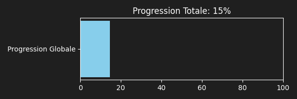
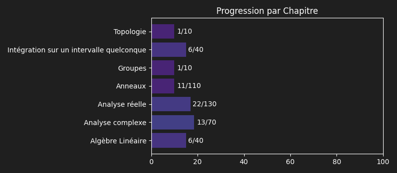

**1** Théorèmes à réviser sur **41**

# 📚 30/09/2026

**1** Théorèmes

## 1. Théorème de dérivation d'une intégrale à paramètre

<b>Chapitre</b>

<blockquote>
Intégration sur un intervalle quelconque
</blockquote>

<b>Énoncé</b>

---

Soit $X$ un ouvert d'un espace vectoriel normé de dimension finie et $I$ un intervalle de $\mathbb{R}$. Soit $f : X \times I \to \mathbb{C}$ telle que :

1. Pour tout $x \in X$, la fonction $t \mapsto f(x, t)$ est continue par morceaux et intégrable sur $I$.
2. La fonction $f$ admet une dérivée partielle selon $x$, notée $\frac{\partial f}{\partial x}$, telle que :
   - Pour tout $x \in X$, $t \mapsto \frac{\partial f}{\partial x}(x, t)$ est continue par morceaux sur $I$.
   - Pour tout $t \in I$, $x \mapsto \frac{\partial f}{\partial x}(x, t)$ est continue sur $X$.
3. Il existe $\varphi \in \mathcal{C}_{m}(I, \mathbb{R}^+)$ intégrable sur $I$ telle que pour tout $(x, t) \in X \times I$, $|\frac{\partial f}{\partial x}(x, t)| \le \varphi(t)$ (hypothèse de domination).

Alors $F : x \mapsto \int_I f(x, t) dt$ est de classe $\mathcal{C}^1$ sur $X$ et :
$$F'(x) = \int_I \frac{\partial f}{\partial x}(x, t) dt$$

---

